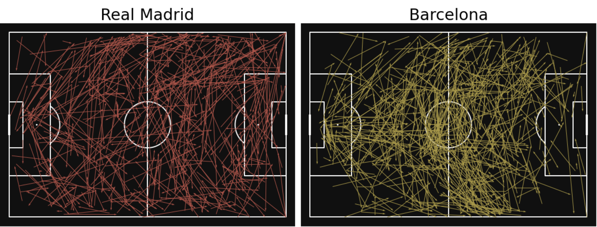

# LaLiga (2019-2020) Play analysis

## Overview

Analysing the LaLiga teams in terms of their passing, attacking and defending plays using the 2019-2020 Season as our reference.

Focusing on play pattern of top teams - Barecelona and Real Madrid, Player Ranking based on multi-criteria-decision-making method.

Generating Report for all the matches of Barcelona and saving it in a pdf file.

## Software 
Jupyter Notebook - Anaconda 

## Result

Player Rating has been calculated using MCDM method.

Report containing our findings using the event data which can be presented to a football coach/manager conveying insights on how their opponents play and providing them with sufficient information to devise counter-strategies, gaining a competitive advantage. All the passing maps for Barcelona against different teams have store under folder **passing_map_report**. Here is an output for one of the El-Clasico match which shows the playing pattern for both the teams through a pass map.

Detailed report for all the matches of Barcelona for LaLiga 2019-2020 is available in folder https://github.com/ACM40960/project-Malhotra-G/blob/main/passing_maps/passMapsLaLiga2019_20.pdf

## Data
We will be using Statsbomb as our data source which has immense detailed open-source data. There are two csv files which are required for this project, these files are in data folder :
- matchwise_eventsdata_2019-2020.csv
- matchwise_seasondata_2019-2020.csv

‘Events Data’ which is used to capture each on-ball event of the match, recorded for all the matches of the league for that particular season.  

## Packages Required

*mplsoccer* - 

mplsoccer is a Python library for plotting soccer/football charts in Matplotlib and loading StatsBomb open-data.

## Installation Instructions
The user **must**  install Jupyter Notebooks prior to running any scripts.

All installation methods and requirements can be found [here](https://docs.jupyter.org/en/latest/install/notebook-classic.html#:~:text=Jupyter%20installation%20requires%20Python%203.3,%2C%20pip%2C%20instead%20of%20Anaconda.)

It is recommended to download [Anaconda](https://www.anaconda.com/products/distribution) for an easier installation

If any **errors** are encountered during the installation, use the [troubleshoot](https://docs.anaconda.com/anaconda/user-guide/troubleshooting/) forum

Following libraries needs to be installed in jupyter notebook using `pip` commmand.

- `pip install mplsoccer`
- `pip install plotly`

## Running the code
Once, the libraries are installed, either user can run the code cell by cell or there is a option to run all.
To run all the cells at once :
- Go to cells tab
- Select run all

## Authors

- [Siddharth Rastogi](https://github.com/Sid-rastogi)
- [Gautam Malhotra](https://github.com/Malhotra-G)

